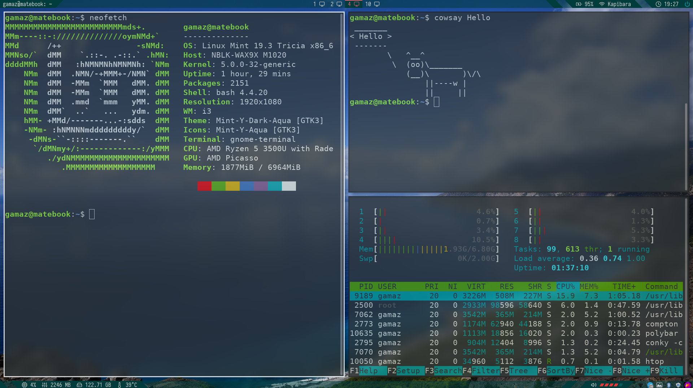

# install-i3-gaps-on-Mint
Step by step install i3-gaps, polybar, compton and other on Linux Mint 19.04 

i3wm is a convenient, minimalistic window Manager that is easy to configure as you wish.
I made a set of installation scripts for easy startup. I use fork i3-gaps instead of pure i3, because it seems more convenient to me. There are also many convenient additions to i3.

# Used Packages 

* i3-gaps https://github.com/Airblader/i3 
* Polybar https://github.com/polybar/polybar
* Compton https://github.com/tryone144/compton.git
* Alternate-layout https://github.com/olemartinorg/i3-alternating-layout
* ROFI
* Variety
* Flameshot
* Conky

# Install

clone this repository or download the archive. 
Each script has a number at the beginning of the name. Then launch it .sh scripts in order up to 4_create_config.sh. 
If you want, you can run the script with the number 5, it will install applications for you (Google Chrome, Telegram, Vim, Postman)
